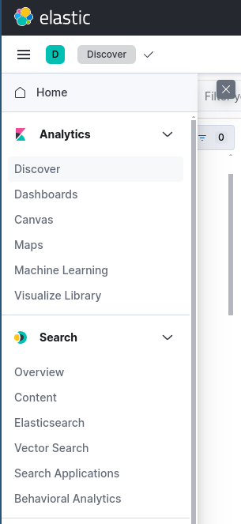
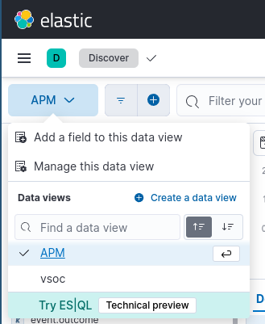
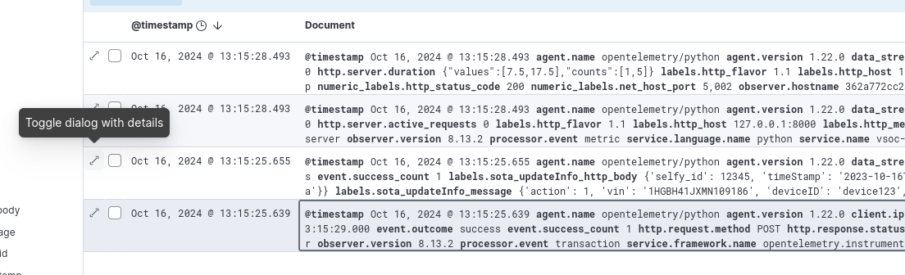
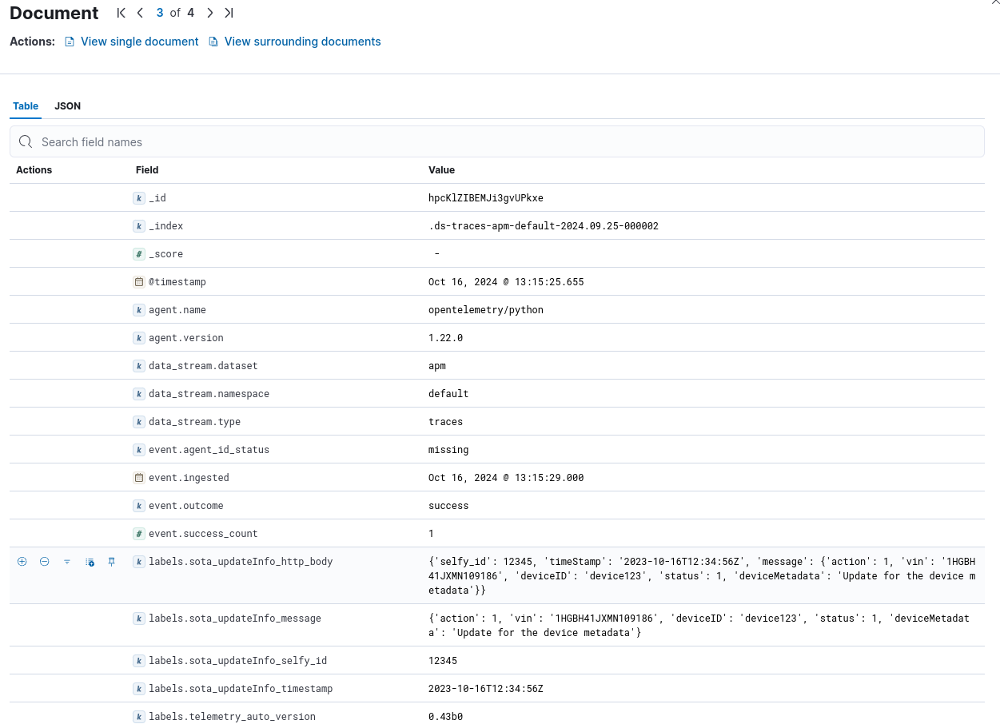

# ELK Stack

The **ELK Stack** is a powerful open-source platform for managing and analyzing large amounts of log and event data in real-time. It consists of three main components:

1. **Elasticsearch**: A distributed, search and analytics engine that stores, indexes, and allows you to search and analyze large datasets quickly. It is built on top of Apache Lucene and provides full-text search capabilities, structured search, and analytics over log data.
2. **Logstash**: A data processing pipeline that ingests, transforms, and sends data to Elasticsearch (or other destinations). It supports a wide variety of data sources, allowing you to parse logs, filter or enrich data, and handle different formats.
3. **Kibana**: A visualization tool that provides a web interface for searching, analyzing, and visualizing data stored in Elasticsearch. It enables users to create dashboards, charts, graphs, and other visual representations of the log data.

Together, the ELK Stack is used for monitoring, troubleshooting, and gaining insights from log data, often deployed for system monitoring, security, and operational analytics. It has applications across IT, security, business intelligence, and other areas where real-time analysis of log data is critical. 

## Where do I find data?

### 1. You can find your logs under "Analytics > Discover"

### 2. Select the APM index

### 3. Now you can see the logs of the set timeframe (see top right corner)

### 4. Open it to see all fields including the transmitted data (e.g., `http_body`, `selfy_id`, or `timestamp`).

