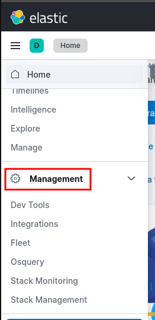
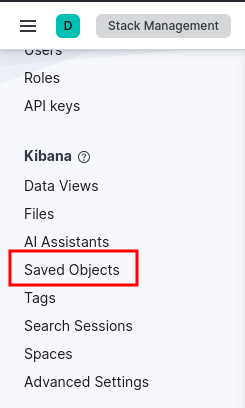
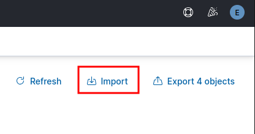
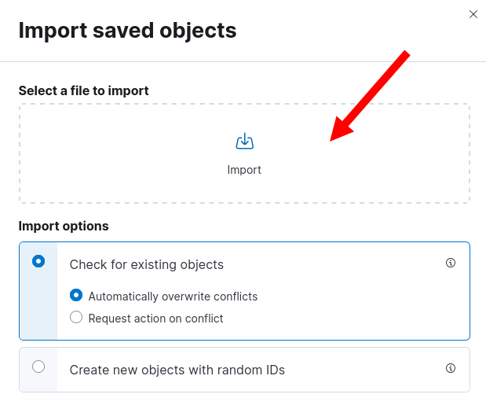
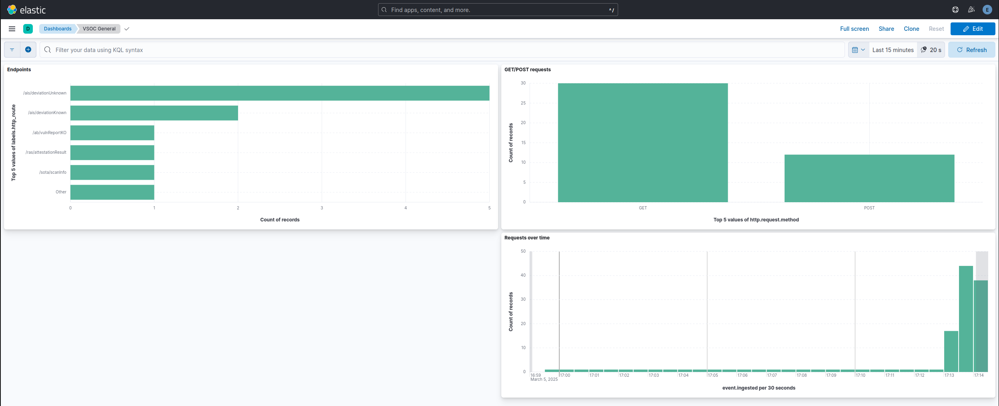

# ELK Stack

The **ELK Stack** is a powerful open-source platform for managing and analyzing large amounts of log and event data in real-time. It consists of three main components:

1. **Elasticsearch**: A distributed, search and analytics engine that stores, indexes, and allows you to search and analyze large datasets quickly. It is built on top of Apache Lucene and provides full-text search capabilities, structured search, and analytics over log data.
2. **Logstash**: A data processing pipeline that ingests, transforms, and sends data to Elasticsearch (or other destinations). It supports a wide variety of data sources, allowing you to parse logs, filter or enrich data, and handle different formats.
3. **Kibana**: A visualization tool that provides a web interface for searching, analyzing, and visualizing data stored in Elasticsearch. It enables users to create dashboards, charts, graphs, and other visual representations of the log data.

Together, the ELK Stack is used for monitoring, troubleshooting, and gaining insights from log data, often deployed for system monitoring, security, and operational analytics. It has applications across IT, security, business intelligence, and other areas where real-time analysis of log data is critical. 

## How to add a dashboard to Kibana

### 1. Select a dashboard 

There are plenty of pre-made dashboards already available in VSOC that can be easily imported to Kibana. To get started, first choose one of the `.ndjson` files in [dashboards folder](/elk/dashboards).

### 2. Open the manager options

On Kibana, open the menu on the left and click on **Management** 

### 3. Open the **Saved Objects** menu

### 4. Click on **Import**

### 5. Drag the selected dashboard template into the upload area

After clicking **Import**, the uploaded dashboard will be created. It can be accessed in the **"Analytics > Dashboards"** path. 

If not already created, the `APM` dataview will be also created to show the data pertinent to the VSOC present in the APM server.

As an example, after receiving some requests, the dashboard **VSOC General** should look something like this:

## Where do I find data?

### 1. You can find your logs under "Analytics > Discover"

### 2. Select the APM index

### 3. Now you can see the logs of the set timeframe (see top right corner)

### 4. Open it to see all fields including the transmitted data (e.g., `http_body`, `selfy_id`, or `timestamp`).

